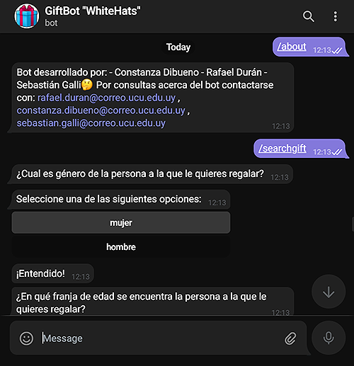

# Proyecto Equipo2 GiftBot
## PII UCU - Proyecto Final de Curso - Equipo 2 - Gift ChatBot


<p align="center">
  
</p>

Llega el día del cumpleaños de la persona más importante para tí y suele pasar que no sabemos qué regalar. ¡No te preocupes! GiftBot es tu mejor asistente. Él te ayudará a construir un perfil basado en determinadas preguntas y te hará fantásticas sugerencias para tu próximo regalo.

## ¿Como encuentro a GiftBot?

Podés buscarlo como GiftBot "WhiteHats" con usuario @whiteHatsGiftBot.

## ¿Cómo funciona GiftBot?
Desde un conjunto de archivos externos se extrae la información necesaria para crear bancos que almacenan distintas clases de categorías de preguntas, las cuales se clasifican como Initial, Main, Mixed y Specific y que también corresponden a distintas fases del mismo nombre. 

Por lo tanto, GiftBot funciona en fases.

Las preguntas clasificadas como Initial están orientadas a recolectar información básica y general sobre la persona a quien se quiere regalar (tales como por ejemplo género y rango de edad). Las preguntas clasificadas como Initial están ideadas exclusivamente para guardar información que no está directamente relacionada con el producto final, pero aún así es información que enriquece los criterios de búsqueda del regalo acorde a las preferencias del usuario y las características generales de la persona a quien se quiere regalar.

Las preguntas clasificadas como Initial son las primeras en interactuar con el usuario una vez que se inicia el procedimiento para la recomendación de regalos y corresponden a la primera fase del programa. Cada una de estas preguntas cuenta con respuestas preestablecidas entre las cuales el usuario debe elegir. La opción de respuesta a cada pregunta seleccionada por el usuario se almacena en lo que llamamos un Perfil de Persona. 

```
Ejemplo de formato de archivo de preguntas clasificadas como Initial:
¿Cual es género de la persona a la que le quieres regalar?;1-mujer,2-hombre
```

Las categorías clasificadas como Main almacenan una afirmación identificadora que representa una categoría general de productos. Una categoría Main es el nivel más amplio o genérico en el que se puede clasificar una categoría (Ejemplos: Home, Sport, Technology).

Las categorías clasificadas como Main son las segundas en interactuar con el usuario y corresponden a la segunda fase del programa. Entre una lista de afirmaciones, el usuario debe elegir aquellas dos afirmaciones que sean más acorde a la persona a quien quiere regalarle. Las dos categorías Main seleccionadas por el usuario a partir de las afirmaciones se almacenan en el antes mencionado Perfil de la Persona.

```
Ejemplo de formato de archivo de preguntas clasificadas como Main:
Le gusta quedarse en casa;1-home
Es hábil para el bricolage;2-tool
Le gusta la tecnología;3-technology
``` 
Las categorías clasificadas como Mixed almacenan preguntas asociadas a la combinación de dos categorías Main, donde además cada pregunta representa una categoría más específica dentro de dicha combinación de dos categorías Main.

Las categorías clasificadas como Mixed son las terceras en interactuar con el usuario y corresponden a la tercera fase del programa. A partir de las dos categorías Main seleccionadas por el usuario, se realiza una búsqueda de las categorías Mixed que están asociadas a la combinación de dichas categorías Main. A partir de ello, se muestra un conjunto de preguntas nuevas que el usuario debe responder con “si” o “no”.

```
Ejemplo de formato de archivo de preguntas clasificadas como Mixed:
home;technology;¿Le gusta usar redes sociales?;cellphone;1-si,2-no
```

Las categorías clasificadas como Specific almacenan preguntas asociadas a un producto puntual (o una gama de productos).

Las categorías clasificadas como Specific son las últimas en interactuar con el usuario y corresponden a la cuarta fase del programa. A partir de aquellas preguntas Mixed a las que el usuario haya respondido "si", se muestra un nuevo conjunto de preguntas a las cuales el usuario debe responder con “si” o “no”. 

```
Ejemplo de formato de archivo de preguntas clasificadas como Specific:
cellphone;¿Le gusta sacar fotos?;selfie stick;1-si,2-no
```
Finalmente, aquella o aquellas preguntas clasificadas como Specific que hayan obtenido como respuesta un "si", devolverán un producto que posteriormente va a ser ingresado a una búsqueda en Mercado Libre.

## ¿Puedo agregar más preguntas al Gift Bot?
Si, es posible agregar, modificar o retirar preguntas a cada una de las distintas fases del bot a través de archivos externos configurables. Actualmente GiftBot lee toda esta información de archivos .txt, pero el sistema está diseñado para que sea posible implementar lectura de otro tipo de archivos. Pero por el momento, si quieres modificar, agregar o retirar preguntas, solamente debes editar los archivos .txt en la carpeta de Assets, procurando seguir el formato correspondiente y que cuentes con una pregunta en las fases anteriores que permita al GiftBot llegar hasta tu pregunta. Todos los archivos .txt de fases de preguntas son configurables y extensibles.

Si tienes más dudas al respecto, puedes contactar con los desarrolladores.

## Comentarios sobre el desarrollo

- En aquellos casos en que el usuario deba responder con un "si" o un "no" y se responda a todas las preguntas con un "no", el programa debe recolectar categorías aleatorias correspondientes a la fase anterior y hacer nuevas preguntas hasta que el usuario pueda encontrar una categoría a la cual poder responder "si". Esta funcionalidad se intentó implementar utilizando handlers con bifurcaciones (es decir, handlers a los cuales se les puede asociar tanto un next handler como un previous handler), que se agregan a la cadena de responsabilidad formada por IStateHandlers, sin embargo actualmente dicha característica no se encuentra en funcionamiento dado que surgió una falla que no se pudo detectar.
- Al implementar las funcionalidades para Telegram, se tuvo problemas con los tiempos de ejecución de los métodos y el tiempo de respuesta del usuario. Se necesitó implementar un tiempo de espera entre que se imprime una pregunta y se recibe el callback de respuesta del botón de Telegram. La solución que se encontró para esto fue utilizar while loops para generar dichas esperas, sin embargo sabemos que no es la solución más eficiente. Creemos que esto se puede mejorar implementando eventos y métodos asincrónicos.
- Se implementaron excepciones en la clase FileReader con el fin de interrumpir el flujo del programa antes de que se inicie el bot en caso de que no se puedan leer los archivos correctamente. Creemos que la implementación de excepciones podría mejorar creando excepciones que engloben tipos de errores más detallados, aunque esto puede implicar cambios importantes en la lógica del programa que haría discutible hasta qué punto valdría la pena crear excepciones tan específicas para detalles pequeños.
- Se implementó un sistema para que el bot lea los archivos externos y cree la cadena de responsabilidad de fases una sola vez antes de iniciar la API de Telegram por razones de optimización.
- Se intentó lograr que más de un usuario pueda hacer uso del bot en paralelo, pero se detectó que al ejecutar el comando /searchgift al mismo tiempo, lo cual hace que a uno de los dos usuarios se le interrumpe el programa y no pueda continuarlo hasta que el usuario anterior termine el proceso, entre otras fallas que no se pudieron resolver. Sin embargo, el comando /searchgift funciona correctamente mientras los usuarios tomen turnos para realizar sus búsquedas.
- Se tomó en cuenta la posibilidad de generar un filtro para precios, pero dado que no se logró implementar correctamente se decidió descartarlo. Pero una posible solución puede ser crear una interfaz IFilter la cual sería implementada por tantos filtros como se quisieran agregar, los cuales tendrán la responsabilidad de filtrar los resultados obtenidos por la API, en este caso, de Mercado Libre.
- No se creó un tipo que englobe InitialQuestion, MainCategory, MixedCategory y SpecificCategory ya que no es posible generalizar estas categorías debido a que cumplen funciones distintas y por tanto crear un tipo ICategory no sería viable. Además, hacer uso de una Interfaz ICategory podría dar lugar a que las categorías fueran sustituibles entre sí, y el programa no maneja estas categorías como intercambiables, sino que las categorías se ejecutan en un orden específico, cada una en una fase en particular, por la lógica de categorización para recomendar un producto final. 
- Dado que las opciones están definidas en función de botones, no consideramos necesario el tener que validar las respuestas, ya que el usuario no cuenta con la libertad de escribirlas. 
- No se realizaron tests de los CommandHandler dado que la función de los mismos es mandar a imprimir mensajes en Telegram y consideramos que no es posible de testear.
- Para testear las fases de preguntas y sus StateHandlers se implementó una emulación de respuestas generadas en la clase TestAnswerReceiver (de tipo IMessageReceiver) para poder trabajar los casos de test que requerían un ingreso de información por parte del usuario.

#### Notas

- ¿Qué desafíos de la entrega fueron los más difíciles?
Consideramos que el desafío más difícil de la entrega fue la implementación de la API de Telegram, ya que entendemos se basa en programación asincrónica y no contamos con los conocimientos suficientes al respecto. Los principales problemas que nos surgieron fueron que la lógica de fases necesitaba generar esperas entre una pregunta y la siguiente y además generar una espera dependiente de la información ingresada por el usuario para pasar a la siguiente pregunta de la fase. No contar con ello hacía que los mensajes se mostraran desordenados y todos a la vez, sin respetar las respuestas del usuario.
- ¿Qué cosas aprendieron enfrentándose al proyecto que no aprendieron en clase como parte de la currícula?
La implementación del patrón Chain of Responsibility, la implementación de botones en Telegram y se investigó sobre el patrón Adapter.
- ¿Qué recursos (páginas web, libros, foros, etc) encontraron que les fueron valiosos para sortear los desafíos que encontraron?
Documentación de .NET, documentación de la API de Telegram, StackOverflow y videos en YouTube.


